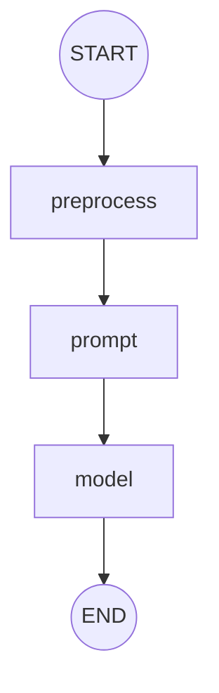
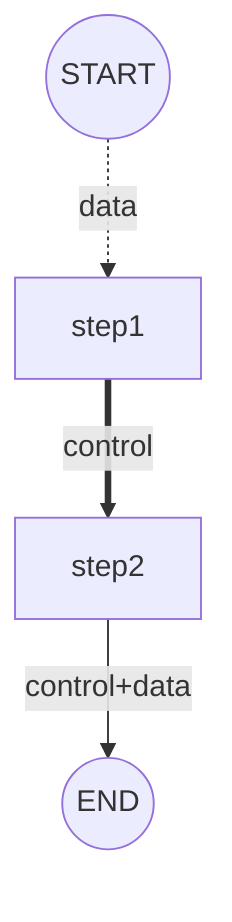
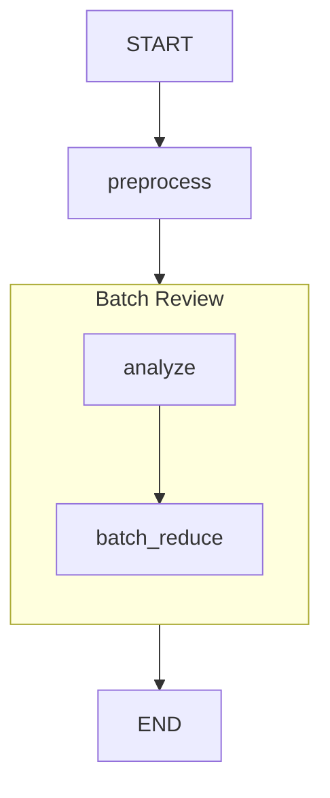

# Graph Visualization

Eino provides Mermaid diagram generation for visualizing Graph and Workflow structures. This is useful for debugging, documentation, and understanding complex orchestration flows.

**Note**: The visualization package is available in the [eino-ext](https://github.com/cloudwego/eino-ext) repository.

## Basic Usage

```go
import "github.com/cloudwego/eino-ext/devops/visualize"

// Create generator
gen := visualize.NewMermaidGenerator("output/dir")

// Compile graph with visualization
runner, err := g.Compile(ctx,
    compose.WithGraphCompileCallbacks(gen),
    compose.WithGraphName("MyGraph"))
```

The generator automatically creates:
- `.md` file with Mermaid diagram
- `.png` image (if mmdc is available or chromedp is set up)

## MermaidGenerator Options

```go
// Create generator with custom settings
gen := visualize.NewMermaidGenerator("output/dir")
```

| Method                             | Description                                         |
| ---------------------------------- | --------------------------------------------------- |
| `NewMermaidGenerator(dir)`         | Create generator that writes to specified directory |
| `NewMermaidGeneratorWorkflow(dir)` | Create generator for Workflow with labeled edges    |

## Workflow Edge Types

In Workflow, edges have semantic meaning:

| Edge Type    | Mermaid Syntax | Description                            |
| ------------ | -------------- | -------------------------------------- |
| control+data | `-- -->`       | Both control flow and data flow        |
| control-only | `==>`          | Only control flow (no data mapping)    |
| data-only    | `-.->`         | Only data flow (no control dependency) |

The MermaidGenerator automatically detects Workflow vs Graph and renders appropriate edge styles.

## Node Rendering

| Node Type    | Shape                      |
| ------------ | -------------------------- |
| Lambda       | Rounded rectangle `(node)` |
| ChatModel    | Rectangle `[node]`         |
| ChatTemplate | Rectangle `[node]`         |
| Tools        | Rectangle `[node]`         |
| START/END    | Circle/Stadium `()`        |
| SubGraph     | Subgraph with label        |

## Example: Visualizing a Graph

```go
g := compose.NewGraph[map[string]any, string]()

g.AddLambdaNode("preprocess", compose.InvokableLambda(func(ctx context.Context, input map[string]any) (map[string]any, error) {
    return input, nil
}))

g.AddChatTemplateNode("prompt", template)
g.AddChatModelNode("model", chatModel)

g.AddEdge(compose.START, "preprocess")
g.AddEdge("preprocess", "prompt")
g.AddEdge("prompt", "model")
g.AddEdge("model", compose.END)

// Compile with visualization
gen := visualize.NewMermaidGenerator("docs")
runner, _ := g.Compile(ctx,
    compose.WithGraphCompileCallbacks(gen),
    compose.WithGraphName("SimplePipeline"))
```

This generates a Mermaid diagram like:



## Example: Visualizing a Workflow

```go
wf := compose.NewWorkflow[Input, Output]()

wf.AddLambdaNode("step1", compose.InvokableLambda(step1)).
    AddInput(compose.START, 
        compose.MapFieldPaths([]string{"data"}, []string{"input"}))

wf.AddLambdaNode("step2", compose.InvokableLambda(step2)).
    AddInput("step1", compose.ToField("result"))

wf.End().AddInput("step2")

// Use workflow-style generator for labeled edges
gen := visualize.NewMermaidGeneratorWorkflow("docs")
runner, _ := wf.Compile(ctx,
    compose.WithGraphCompileCallbacks(gen),
    compose.WithGraphName("WorkflowExample"))
```

This generates a Mermaid diagram with labeled edges:



## Custom Output

For custom output handling:

```go
buf := &bytes.Buffer{}
gen := &visualize.MermaidGenerator{
    w:         buf,
    autoWrite: false,
}

runner, _ = g.Compile(ctx,
    compose.WithGraphCompileCallbacks(gen),
    compose.WithGraphName("MyGraph"))

// Write to custom location
mermaidCode := buf.String()
```

## Integration with Parent Graph

When BatchNode or sub-Graphs are used, they are rendered as nested subgraphs:



## Image Generation

MermaidGenerator can generate PNG/SVG images:

1. **Using mmdc** (Mermaid CLI): Install with `npm install -g @mermaid-js/mermaid-cli`
2. **Using chromedp**: Falls back to browser-based rendering

If neither is available, only the `.md` file is generated.

## Best Practices

1. **Name your graphs**: Use `compose.WithGraphName("Name")` for meaningful diagrams
2. **Use descriptive node names**: Node keys become labels in the diagram
3. **Avoid cycles**: Graph must be acyclic for visualization
4. **Check intermediate states**: Visualization helps debug complex flows

## Related Information

- Visualization package: `github.com/cloudwego/eino-ext/devops/visualize`
- Mermaid docs: https://mermaid.js.org/
